# SAP Product Copilot

Azure OpenAI-powered Copilot for SAP users, enabling:

- Choosing the right product.
- Assisting in ordering a product (final ordering is not implemented).
- Providing details of a product.
- Updating an existing product (only the price in this demo).
- Entering a new product into the system.

Unlike traditional bots, where users are constrained to rigid, predefined pathways, this AI assistant provides the flexibility to interact in natural language. It mimics a conversational experience like interacting with a human, making it intuitive and user-friendly. Users can freely express their queries and commands in everyday language, eliminating the need to understand complex code or specific command language.

No more clicking through endless menus or decoding tech jargon. Just type what you need in your natural language. It’s as easy as chatting with a friend - quick, straightforward, and no hassle!

**Greetings in Teams**

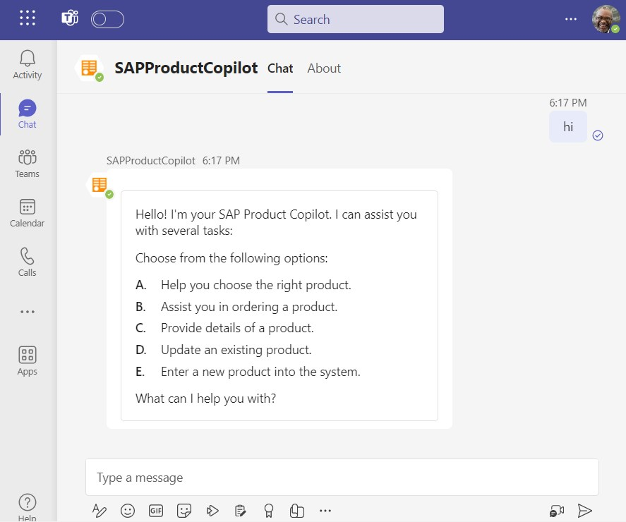

**Architecture**

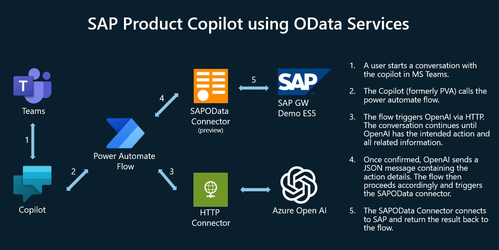

## Prerequesites

1. Power Platform Access
    - Power Virtual Agent (PVA), to create the copilot https://web.powerva.microsoft.com/
    - Power Automate Flows: https://make.powerautomate.com/
    - Recommended for productive use is separated DEV and PROD environments
    - Trial license: https://learn.microsoft.com/en-us/power-apps/maker/signup-for-powerapps
1. Azure Subscription
    - Azure Trial: https://azure.microsoft.com/en-us/free
1. Azure OpenAI Service
    - Deployment Guide: https://learn.microsoft.com/en-us/azure/ai-services/openai/how-to/create-resource?pivots=web-portal
    - Request Access to OpenAI as described.
    - gpt-4-32k is recommended for this use case due to larger context with longer discussions.
    - Therefore pay attention during the request for regions that can provide gpt-4-32k (e.g. Several in the US, France, Canada, Sweden)
1. SAP System
    - For learning and demo purpose you can use the SAP Gateway Demo System ES5
    - Signup here: https://developers.sap.com/tutorials/gateway-demo-signup.html
    
# Setup

## Azure OpenAI Service

- Follow this documentation to deploy the Azure OpenAI Service: https://learn.microsoft.com/en-us/azure/ai-services/openai/how-to/create-resource?pivots=web-portal   
- Once the OpenAI Service is deployed go to the OpenAI Studio, enter Deployments and deploy the gpt-4-32k model.  

    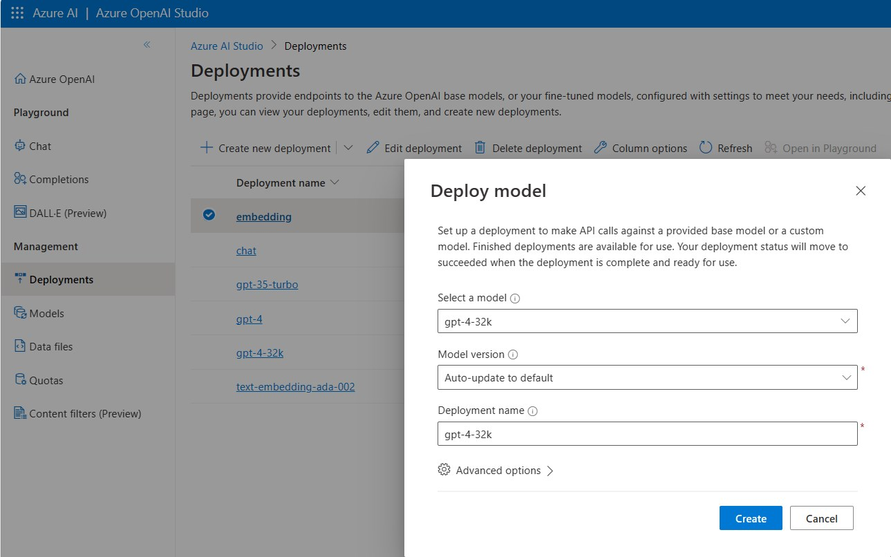

- Retrieve your endpoint URL and Key in "Chat Playground" -> "View code".

    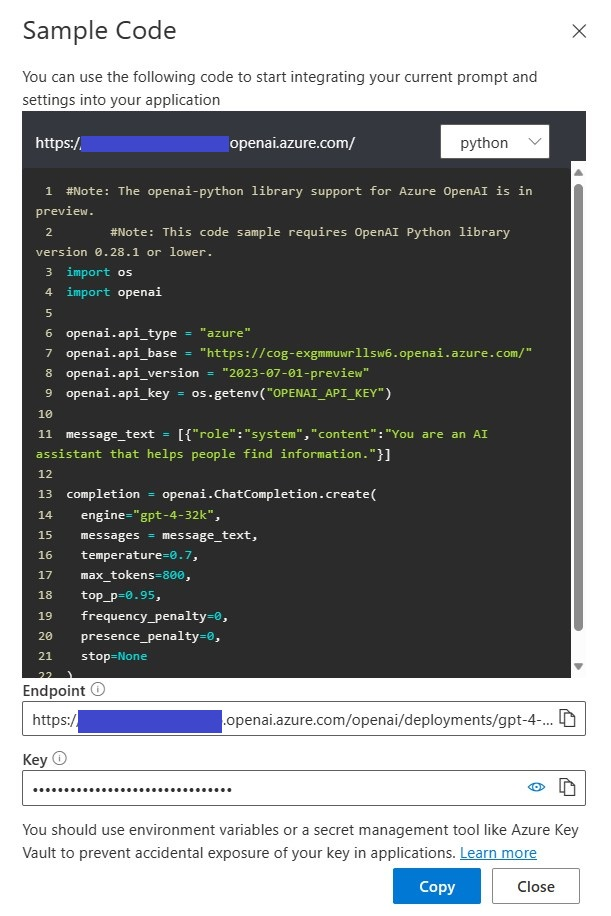

## Import the Solution

This step will import the required components into your environment. Make sure you are connected to your Non-PROD environment.

- Download the solution as zip file: [Download the Solution](https://github.com/mimergel/SAP_Product_Copilot/raw/main/solution/SAPProductCopilot_1_0_0_2.zip).

- Login to https://make.powerapps.com/ 
- Go to Solutions.
- Choose "Import solution".

    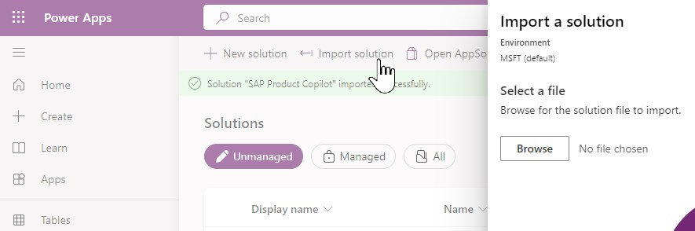  

- Browse files and select the downloaded SAPProductCopilot_[version number].zip.
- During the subsequent steps you'll need to update the connection references:

    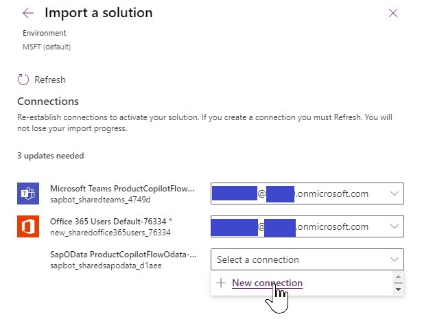  

- For Teams and Office 365 you might have already connections and you could simply choose from the list. Otherwise create these as well.
- Create the required SAP Odata Connection:

    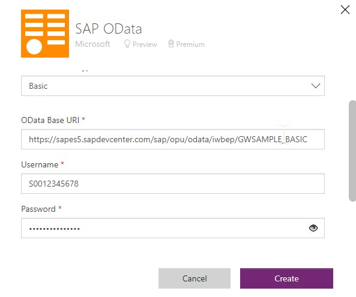  

    Values for SAP ES5 Demo System are:
    - OData Base URI: https://sapes5.sapdevcenter.com/sap/opu/odata/iwbep/GWSAMPLE_BASIC
    - Username e.g.: S001234567
    - Password: xxxxxxxxxx (Note: during preview only basic authentication is available)
    
 - Now after refreshing and entering the ODATA connection reference you can proceed to import the solution.

    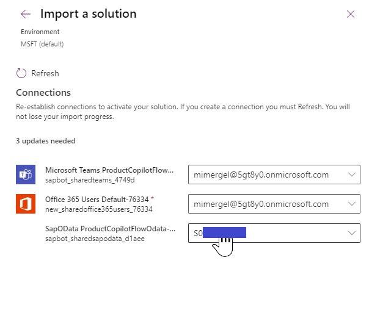  

## Adapt the HTTP Connector in the Flow

- Enter your Azure OpenAI URL and API-Key from the Azure Open AI Service Chat playground.

    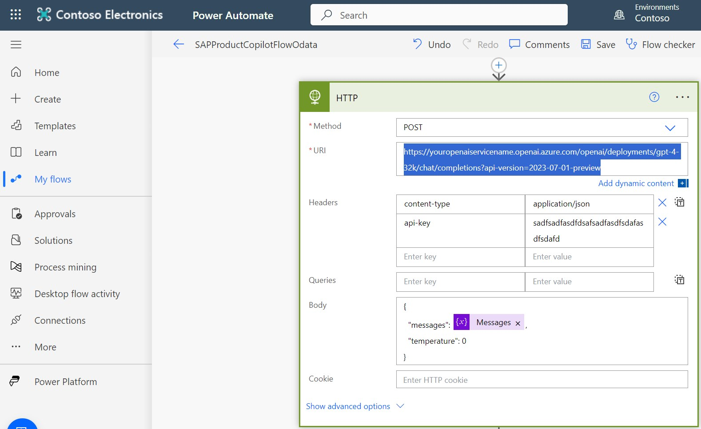  

- For now you can enter this directly in clear text. For later production use it is recommended to configure these as secrets and put references to the secrets.  

## Publish the Bot

- Login to https://web.powerva.microsoft.com/ 
- You should see the imported copilot. If not check that you are in the same environment where you have imported the solution. 

    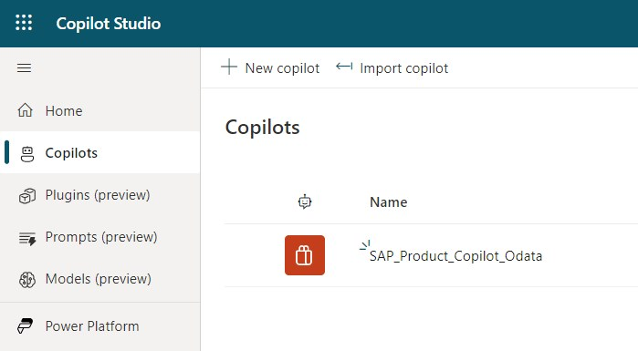  

- Click on the name and then go to "Publish"

    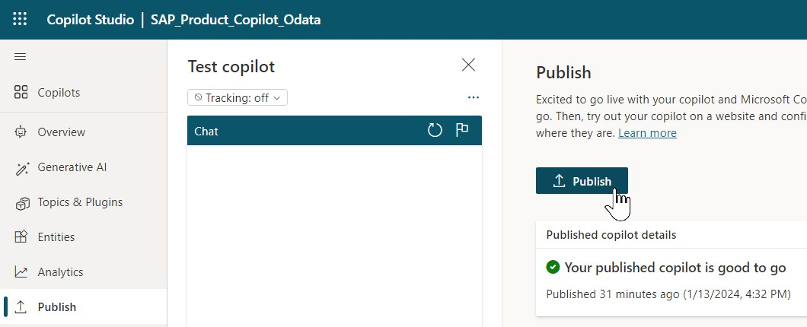  

- Go to "Settings" -> "Channels" to connect the Copilot with Teams.

    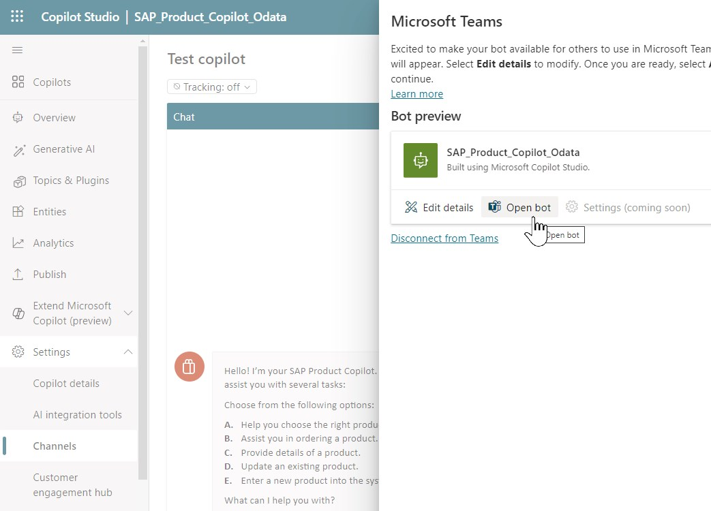  

- Finally open the Copilot in Teams by using the web app instead
- Cancel the request to open the teams app to avoid opening your desktop app and leaving your work or school tenant.
- Then test: 

    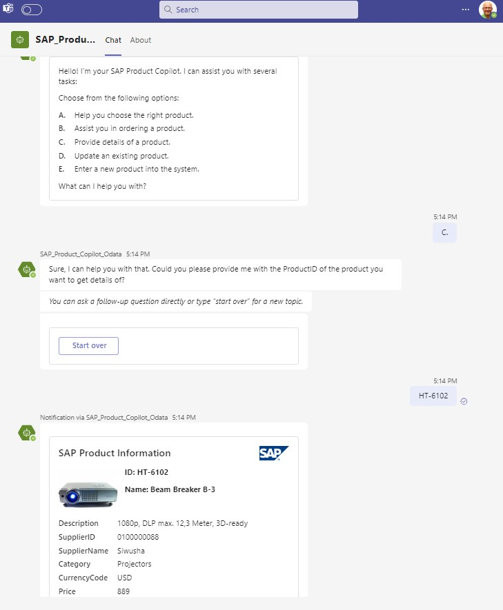  

## Troubleshooting

- In case of errors most likely the flow failed.    
    - Check here: https://make.powerautomate.com/ in  
        - "My Flows"    
        - "28-days run history"   
- The logs of the flow run provide helpful error messages.   

    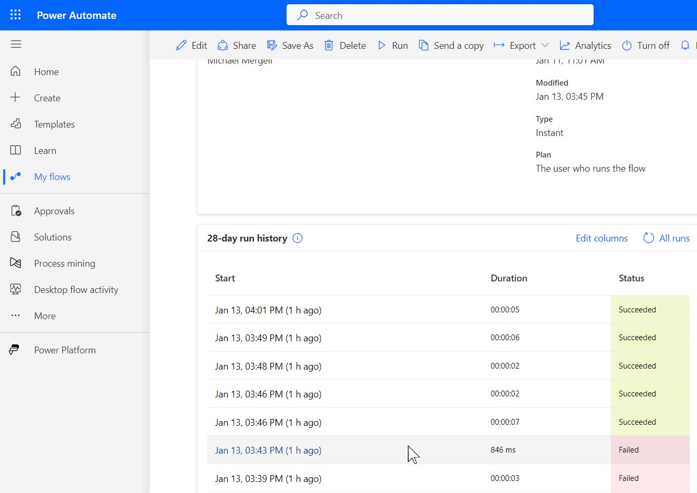  

    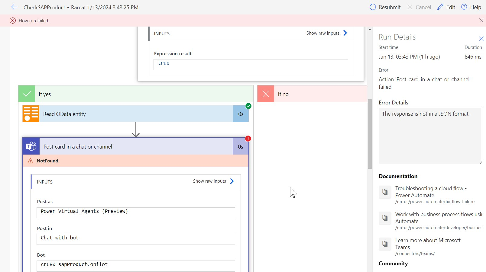  